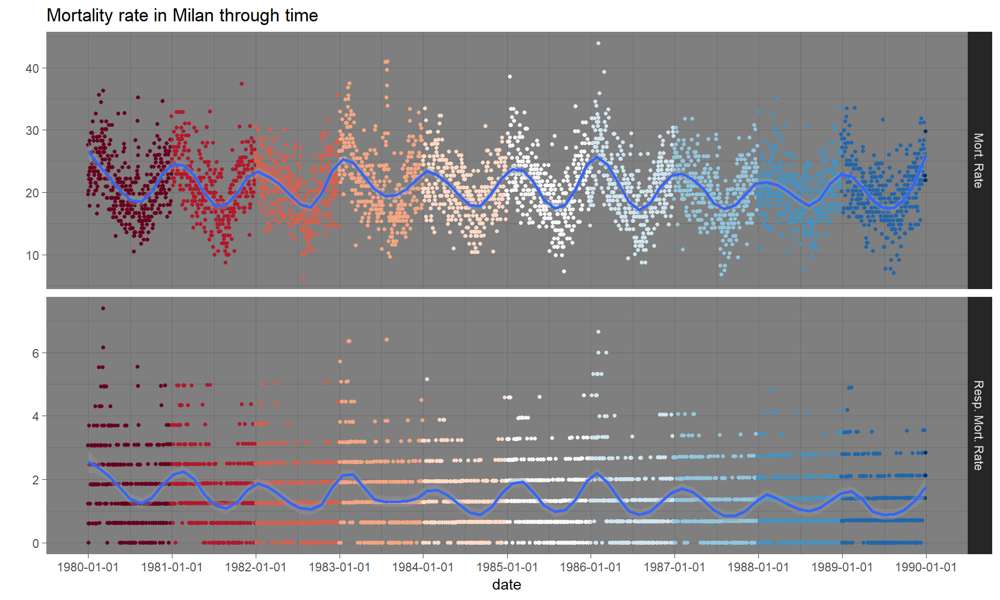

# Bayesian Statistics project

Project for the Bayesian Statistics exam at University of Trieste

## Problem description

In this project I analysed a dataset regarding deaths in Milan. The dataset contains, for each day between 1/01/1980 and 31/12/1989:

* the number of deaths occurred in Milan (`tot.mort`);
* the number of deaths for respiratory issues in Milan (`resp.mort`).

We have for each day some explanatory variables too:

* the mean temperature (`mean.temp`);
* the relative humidity (`rel.humid`);
* the sulphur dioxide level in ambient air (`SO2`);
* the total suspended particles in ambient air (`TSP`).

The dataset has been described in [Vigotti, M.A., Rossi, G., Bisanti, L., Zanobetti, A. and Schwartz, J. (1996). Short term effect of urban air pollution on respiratory health in Milan, Italy, 1980-1989. Journal of Epidemiology and Community Health, 50, 71-75.](https://www.ncbi.nlm.nih.gov/pmc/articles/PMC1060893/) and it has been analysed in [Ruppert, D., Wand, M.P. and Carroll, R.J. (2003), Semiparametric Regression Cambridge University Press.](http://stat.tamu.edu/~carroll/semiregbook/).

The aim of the project is to build a predictive model for `tot.mort` and `resp.mort` and to understand which are the variables that mostly affect the probability of death.